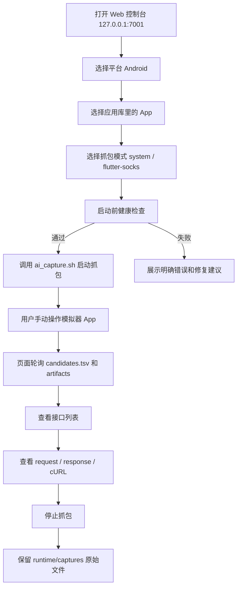
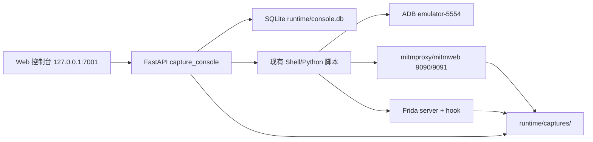

# 长期安卓抓包平台规划书

版本：2026-05-12  
项目目录：`/Users/wan/AI抓包`  
当前定位：本机长期可用的 Android App 抓包控制台  
默认设备：`Medium_Phone_API_36.1 / emulator-5554`

当前交付边界：先完整建设 Android 端；iOS 只预留入口和扩展位，不进入本期抓包实现。

## 1. 项目背景

当前工作区已经具备一套可运行的 Android 抓包基础设施：

- `scripts/ai_capture.sh`：统一抓包启动入口。
- `scripts/ai_capture_stop.sh`：停止 exporter 和 Frida hook。
- `scripts/ai_capture_status.sh`：读取当前抓包状态。
- mitmproxy/mitmweb：负责代理、流量展示、原始流量保存。
- Frida：用于 Flutter/Dart 或不走系统代理的 App 流量导流。
- `runtime/captures/<session>/`：保存原始抓包结果和导出的 request/response 文件。
- `capture_console/`：本机 FastAPI 控制台后端。
- `web/` 与 `capture_console/static/index.html`：控制台前端入口。

用户的核心诉求不是单次抓包，而是长期稳定使用：换不同 App 时不需要重新理解脚本、不误开模拟器、不丢登录态、能在页面上启动抓包、操作 App、查看接口、导出请求与响应。

## 2. 建设目标

### 2.1 总目标

建设一套本机长期可用的 Android App 抓包平台，把已有脚本能力产品化，让日常操作变成：

1. 打开 Web 控制台。
2. 选择 Android。
3. 选择目标 App。
4. 点击启动抓包。
5. 在模拟器里手动操作功能。
6. 在页面查看业务接口、请求数据、响应数据、cURL。
7. 停止抓包，保留原始文件。
8. 关闭项目后页面记录清空，下次重新开始。

### 2.2 V1 核心目标

- 固定使用 `Medium_Phone_API_36.1 / emulator-5554`，保留 Google Play 和 App 登录态。
- 只允许一个 active capture，避免多 exporter、多 Frida hook、多 mitm 进程抢端口。
- 支持 `system` 和 `flutter-socks` 两种抓包模式。
- 结果页能按业务接口查看完整 request/response。
- 页面提供 cURL 导出。
- Web 服务重启后清空页面抓取链接记录，但不删除原始文件。
- 默认只监听 `127.0.0.1`。
- 页面保留 iOS 平台入口，但显示为“预留/未启用”，不能触发任何 iOS 抓包命令。

### 2.3 非目标

- V1 不做公网部署。
- V1 不做账号系统。
- V1 不做自动 UI 操作录制。
- V1 不保证所有 App 都能解密，证书绑定和自定义 native 协议需要单独处理。
- V1 不重写 ADB、Frida、mitmproxy 底层逻辑。
- V1 不实现 iOS 抓包；只预留页面入口、后端枚举值、数据模型扩展空间和后续文档位置。

### 2.4 Android 先行交付边界

本规划书后续实施必须遵守 Android 先行原则：

- 所有 P0、P1、P2、P3 任务均以 Android 为唯一可执行平台。
- iOS 入口只允许出现在平台选择区、路由占位、配置枚举和文档说明中。
- iOS 入口点击后只能展示“暂未实现，后续扩展”的说明。
- 不允许在当前启动流程中调用 iOS simulator、iOS proxy、证书安装或任何 iOS 抓包命令。
- 不允许为了兼容 iOS 改动 Android 抓包主链路，除非该改动对 Android 本身有直接收益。
- iOS 真正实现前需要重新出独立技术方案和风险评审。

## 3. 当前状态评估

### 3.1 已完成能力

| 模块 | 当前状态 | 说明 |
|------|----------|------|
| 保留模拟器 | 已具备 | 使用 `Medium_Phone_API_36.1`，保留 Google 账号和应用数据 |
| Web 控制台 | 已具备 | FastAPI 监听 `127.0.0.1:7001` |
| 应用库 | 已具备 | SQLite 保存应用名、包名、Activity、默认模式、备注 |
| 抓包任务 | 已具备 | SQLite 保存当前项目运行期任务 |
| 任务生命周期 | 已具备 | 启动、停止、状态检查 |
| 单任务限制 | 已具备 | active session 冲突保护 |
| 结果读取 | 已具备 | 读取 `candidates.tsv`、meta、request、response |
| cURL 导出 | 已具备 | 从 request headers/body 构造 cURL |
| 旧记录清理 | 已具备 | 服务启动/关闭清空任务记录 |
| React/Vite 源码 | 已具备 | 但当前机器无 `npm`，实际使用 fallback UI |

### 3.2 当前主要缺口

- 页面交互仍偏工具型，缺少明确的“抓包向导”。
- 健康检查信息还不够产品化，错误修复建议不够具体。
- 接口检索、过滤、收藏、标注能力不足。
- 历史原始文件虽然保留，但页面重启后不提供旧文件导入入口。
- 缺少“本次任务报告”一键导出。
- 缺少长期维护脚本，例如环境自检、依赖安装检查、端口占用诊断。
- 前端构建依赖未完整落地，本机没有 `npm`。
- 缺少端到端测试，当前主要是核心单元测试。

## 4. 用户流程设计

### 4.1 标准抓包流程



iOS 在本期流程中不是可执行分支。页面可以显示 iOS 卡片，但该卡片只能进入说明页或 disabled 状态。

### 4.2 项目关闭后的行为

关闭 Web 服务或重启项目后：

- 清空 SQLite 中的抓包任务记录。
- 页面历史任务显示为空。
- 应用库继续保留。
- 原始抓包目录继续保留在 `runtime/captures/`。
- 下次打开后需要重新启动新任务，不自动把旧抓包链接导入页面。

这个行为符合用户当前要求：避免页面长期堆积大量过期抓取链接。

### 4.3 旧文件查看流程

建议 V1.2 增加“导入本地抓包目录”功能：

1. 页面默认不显示旧记录。
2. 用户点击“导入历史目录”。
3. 后端列出 `runtime/captures/` 下的候选目录。
4. 用户选择某个目录临时导入当前页面。
5. 导入记录仍然是当前项目运行期记录，下次重启继续清空。

这样既满足“关闭项目清除记录”，又保留排查旧接口的能力。

## 5. 系统架构

### 5.1 总体架构



### 5.2 分层职责

| 层级 | 职责 | 不做什么 |
|------|------|----------|
| 前端 UI | 选择 App、展示状态、展示接口、导出 cURL | 不直接执行 ADB/Frida |
| FastAPI 后端 | 编排脚本、状态管理、索引文件、提供 API | 不重写底层抓包 |
| SQLite | 应用库、当前项目运行期任务记录 | 不存储大体积 request/response |
| 脚本层 | 启动/停止 mitm、Frida、exporter、ADB 设置 | 不承载产品状态 |
| 文件层 | 保存原始抓包 artifacts | 不依赖数据库迁移 |

## 6. 数据模型规划

### 6.1 应用表 apps

用途：长期保存常用 App。

建议字段：

| 字段 | 类型 | 说明 |
|------|------|------|
| id | integer | 主键 |
| name | text | 应用显示名 |
| package_name | text | Android 包名，唯一 |
| activity | text | 启动 Activity，可为空 |
| default_mode | text | `system` 或 `flutter-socks` |
| notes | text | 备注，例如登录状态、特殊说明 |
| last_success_at | text | 最近一次成功抓包时间 |
| created_at | text | 创建时间 |
| updated_at | text | 更新时间 |

### 6.2 抓包任务表 capture_sessions

用途：当前项目运行期任务状态。服务关闭后清空。

建议字段：

| 字段 | 类型 | 说明 |
|------|------|------|
| id | integer | 主键 |
| app_id | integer | 关联应用 |
| app_name | text | 冗余应用名 |
| package_name | text | 冗余包名 |
| mode | text | 抓包模式 |
| outdir | text | 原始文件目录 |
| status | text | starting/running/stopping/stopped/failed |
| web_url | text | mitmweb 链接 |
| error | text | 错误信息 |
| started_at | text | 启动时间 |
| stopped_at | text | 停止时间 |
| created_at | text | 创建时间 |
| updated_at | text | 更新时间 |

### 6.3 后续可扩展表

V1.2 可增加：

- `flow_notes`：接口备注、业务标签、是否收藏。
- `capture_exports`：导出记录。
- `health_events`：环境检查历史。
- `app_profiles`：同一个 App 的不同抓包配置。

## 7. API 规划

### 7.1 当前核心 API

| API | 方法 | 用途 |
|-----|------|------|
| `/api/status` | GET | 当前环境和任务状态 |
| `/api/cleanup` | POST | 一键清理脏状态 |
| `/api/apps` | GET/POST | 应用库列表和新增 |
| `/api/apps/{id}` | PUT/DELETE | 更新和删除应用 |
| `/api/installed-apps` | GET | 扫描模拟器已安装应用 |
| `/api/captures` | GET | 当前项目运行期任务列表 |
| `/api/captures/start` | POST | 启动抓包 |
| `/api/captures/stop` | POST | 停止抓包 |
| `/api/captures/{id}/flows` | GET | 接口列表 |
| `/api/captures/{id}/flows/{flow_id}` | GET | 接口详情 |
| `/api/captures/{id}/flows/{flow_id}/curl` | GET | 导出 cURL |

### 7.2 建议新增 API

| API | 方法 | 优先级 | 用途 |
|-----|------|--------|------|
| `/api/environment/check` | GET | P0 | 完整环境检查 |
| `/api/captures/importable` | GET | P1 | 列出可导入历史目录 |
| `/api/captures/import` | POST | P1 | 临时导入旧目录 |
| `/api/captures/{id}/report` | GET | P1 | 生成本次抓包报告 |
| `/api/flows/search` | GET | P1 | 当前任务接口搜索 |
| `/api/flows/{flow_id}/note` | POST | P2 | 接口标注 |
| `/api/apps/{id}/launch` | POST | P2 | 只启动 App，不抓包 |

后端可以预留平台字段，例如 `platform=android|ios`，但 V1 所有实际执行类 API 只接受 `android`。如果传入 `ios`，必须返回明确的未实现错误，而不是尝试启动任何流程。

## 8. 前端产品规划

### 8.1 页面结构

建议页面分为 5 个主要区域：

1. 顶部状态栏
2. 平台选择
3. 应用库与抓包启动
4. 当前任务接口列表
5. 接口详情与导出

平台选择区必须明确区分：

- Android：可用，进入完整抓包流程。
- iOS：预留，展示“后续扩展，当前不可用”。

### 8.2 状态栏

需要持续展示：

- 当前平台：Android。
- 目标设备：`emulator-5554`。
- 模拟器是否在线。
- 是否解锁。
- 当前前台 App。
- 当前抓包状态：idle/running/dirty/error。
- proxy/exporter/frida 状态。
- mitmweb 链接。

### 8.3 抓包启动向导

建议把启动抓包拆成三步：

1. 选择 App。
2. 选择模式。
3. 健康检查并启动。

每一步都应显示明确提示：

- `system`：适合普通走系统代理的 App。
- `flutter-socks`：适合 Flutter/Dart 或不走系统代理的 App。
- 如果 Frida server 不可用，告诉用户需要启动 Frida。
- 如果模拟器未解锁，告诉用户先解锁。
- 如果包名不存在，告诉用户先安装应用或修正包名。

### 8.4 接口列表

列表页只显示摘要：

- method
- status
- host
- path
- score
- 是否有 request JSON
- 是否有 response JSON
- 时间
- 业务标签

不要在列表页直接加载大响应体。

### 8.5 接口详情

详情页展示：

- 完整 URL。
- Method 和 status。
- Request headers 原文。
- Request body，支持 JSON 格式化和 raw 文本。
- Response headers 原文。
- Response body，支持 JSON 格式化和 raw 文本。
- 文件路径。
- cURL。

敏感信息必须原样展示，但页面顶部持续标注：仅限本机可信环境使用。

### 8.6 关闭项目后的历史策略

页面应明确说明：

- 当前页面只显示本次项目运行期任务。
- 关闭项目后记录会清空。
- 原始文件不会删除。
- 如需看旧文件，使用“导入历史目录”。

## 9. 抓包模式规划

### 9.1 system 模式

适用场景：

- App 遵守 Android 系统代理。
- App 信任用户 CA 或系统 CA。
- 普通 WebView、OkHttp、Retrofit 等常规网络栈。

启动动作：

- 启动 mitmweb HTTP proxy。
- 设置 Android global `http_proxy=10.0.2.2:9090`。
- 启动 exporter。
- 不启动 Frida hook。

风险：

- App 不信任 CA 时 HTTPS 不可解密。
- App 不走系统代理时抓不到。

### 9.2 flutter-socks 模式

适用场景：

- Flutter/Dart App。
- 不走 Android 系统代理。
- 需要 Frida hook native connect / TLS 验证逻辑。

启动动作：

- 启动 SOCKS5 兼容 mitm stack。
- 清空 Android global `http_proxy`。
- 启动 exporter。
- 启动 Frida hook，将 App 流量导向 `10.0.2.2:9090`。

风险：

- Frida server 必须可用。
- App 加固、反调试、native 自定义协议可能导致失败。
- 不是所有 Flutter 版本都能稳定 hook。

## 10. 状态自愈规划

### 10.1 启动前健康检查

启动抓包前必须检查：

- `emulator-5554` 是否在线。
- 当前设备是否解锁。
- 目标 package 是否存在。
- Activity 是否可解析。
- `9090/9091` 是否可用或已由正确 mitm 进程监听。
- exporter 是否已存在。
- Frida hook 是否已存在。
- `flutter-socks` 模式下 Frida server 是否 running。
- Android global `http_proxy` 是否与当前模式冲突。

### 10.2 脏状态识别

典型脏状态：

- exporter running，但数据库没有 active session。
- Frida hook running，但页面显示 idle。
- 端口 9090/9091 被未知进程占用。
- Android 还残留 HTTP proxy，但当前要启动 `flutter-socks`。
- pid 文件存在但进程已经死掉。

### 10.3 一键清理动作

清理应执行：

- 停止 exporter。
- 停止 Frida hook。
- 清理 stale pid 文件。
- 可选清空 Android global proxy。
- 保留 mitmweb 页面和原始文件。
- 将 active session 标记为 stopped 或清空当前任务记录。

## 11. 文件与存储规划

### 11.1 原始文件策略

原始文件继续存储在：

`runtime/captures/<session>/`

不得迁移、改名或删除，除非用户明确执行清理。

### 11.2 页面记录策略

SQLite 中的抓包任务记录只代表当前项目运行期状态：

- 服务启动时清空。
- 服务关闭时清空。
- 页面刷新不清空。
- 关闭整个项目或重启 Web 后清空。

### 11.3 历史目录策略

旧目录默认不显示，避免页面堆积。

后续增加手动导入：

- 只导入当前会话。
- 不改变原始目录。
- 可导入后查看接口详情。
- 下次重启仍清空。

## 12. 安全与隐私规划

### 12.1 本机访问

默认只监听：

`127.0.0.1:7001`

不允许默认监听 `0.0.0.0`。

### 12.2 敏感信息

平台会展示：

- Authorization
- Cookie
- device id
- request body
- response body
- token

因此页面必须持续提示：

仅限本机可信环境使用。

### 12.3 后续多人使用

如果未来要局域网访问，必须先增加：

- 登录认证。
- 访问控制。
- token/header 脱敏开关。
- 操作审计。
- HTTPS 或反向代理安全配置。

## 13. 测试规划

### 13.1 单元测试

继续覆盖：

- 单 active session 限制。
- 服务重启清空任务记录但保留应用库。
- `candidates.tsv` 解析。
- request/response 详情读取。
- cURL 导出。
- 状态解析与 dirty state 判断。

### 13.2 集成测试

建议新增：

- 启动 Web 控制台后 `/api/status` 返回正常。
- 添加 App 后 `/api/apps` 能查询。
- 启动抓包后创建新 outdir。
- 停止抓包后 exporter/Frida hook 停止。
- 服务重启后 `/api/captures` 为空。

### 13.3 端到端测试

建议使用内置浏览器或 Playwright 方式验证：

- 页面能加载。
- 应用库显示 MelodyCraft。
- 点击启动抓包时若环境异常，页面能显示明确错误。
- 点击历史任务能显示接口列表。
- 点击接口能显示 request/response/cURL。

### 13.4 真机/模拟器测试矩阵

| 场景 | 预期 |
|------|------|
| 模拟器未启动 | 页面提示设备未在线 |
| 模拟器锁屏 | 页面提示需要解锁 |
| App 未安装 | 页面提示包名不存在 |
| Frida server 未运行 | `flutter-socks` 启动失败并提示 |
| 端口被占用 | 页面提示端口冲突 |
| system 模式 | Android global proxy 被设置 |
| flutter-socks 模式 | Android global proxy 被清空 |
| Web 重启 | 历史任务为空，应用库保留 |

## 14. 里程碑规划

### P0：稳定当前 V1

目标：保证每天可用，不误开模拟器，不留脏状态。

任务：

- 完善环境健康检查文案。
- 页面显示更清晰的 dirty state 和修复建议。
- 增加手动刷新状态。
- 增加停止任务后的状态二次验证。
- 增加服务重启清理记录的测试。
- README 补充“页面记录清空但原始文件保留”的说明。

验收：

- 模拟器在线时能启动抓包。
- 模拟器异常时不会盲目执行失败命令。
- Web 重启后历史任务为空。
- 应用库不会丢。

### P1：提升接口查看效率

目标：让用户快速定位业务接口。

任务：

- 接口列表增加搜索。
- 支持按 host、path、method、status 过滤。
- 业务接口优先排序。
- 增加“隐藏 CDN/图片资源”开关。
- 增加“只看有 request body / response JSON”的筛选。
- 增加当前任务报告导出。

验收：

- 能快速过滤出 `/aisong/portal/mv/create` 类接口。
- 能一键导出本次任务接口清单。
- 大响应体不会拖慢列表页。

### P2：历史目录手动导入

目标：不默认显示旧记录，但允许需要时查看旧文件。

任务：

- `/api/captures/importable` 列出 `runtime/captures` 候选目录。
- 页面增加“导入历史目录”按钮。
- 导入后生成当前运行期 session 记录。
- 支持导入后查看接口详情。
- 重启后仍清空导入记录。

验收：

- 新开项目页面默认空历史。
- 手动导入旧目录后能查看接口。
- 再次重启后历史仍为空。

### P3：前端产品化

目标：替换 fallback UI，使用 React/Vite 产品界面。

任务：

- 安装或固定 Node/npm 环境。
- 构建 React/Vite 前端。
- 增加清晰布局、状态卡片、任务向导、接口详情抽屉。
- 增加加载态、错误态、空状态。
- 增加响应式布局。

验收：

- `scripts/start_console.sh` 能自动构建或使用已有 dist。
- 页面操作不依赖 fallback UI。
- 移动窗口尺寸下仍可用。

### P4：自动化辅助能力

目标：围绕 Android 降低重复手动操作成本，但不替代用户主动操作。

任务：

- 集成 Android Maestro flow 管理。
- 支持从页面启动 Android 预设打开 App flow。
- 支持记录常用操作步骤说明。
- 后续考虑 App 页面截图和接口时间线对齐。

验收：

- 能从页面打开 Android 目标 App。
- 抓包任务能关联操作备注。
- 不影响手动操作模式。

### P5：iOS 入口预留与扩展预研

目标：只做入口和方案预研，不实现抓包执行链路，不影响 Android 主线。

任务：

- 页面保留 iOS 平台卡片，但状态为 disabled 或 reserved。
- 后端保留平台枚举和错误返回结构。
- 数据模型评估是否需要平台字段，避免未来硬编码 Android。
- 明确 iOS 抓包依赖：Simulator、mitmproxy、证书安装、代理配置。
- 设计 iOS app profile 数据结构。
- 控制台继续保留 iOS disabled 状态。
- 不在 Android 主流程里混入 iOS 逻辑。
- 输出独立 iOS 技术方案后，才能进入实现评审。

验收：

- iOS 入口不报错，但明确提示“暂未实现”。
- Android 主流程无回归。
- 有独立 iOS 技术方案文档。
- 代码中不存在任何实际调用 iOS 抓包命令的入口。

## 15. 风险清单

| 风险 | 影响 | 应对 |
|------|------|------|
| App 证书绑定 | 无法解密 HTTPS | 使用 Frida hook、passthrough、或接受只能抓元数据 |
| Flutter/Dart 版本差异 | hook 失败 | 保留多种 hook 策略和失败日志 |
| 模拟器误切换 | 登录态丢失或抓错设备 | 固定 `emulator-5554` 和 AVD 名，禁止自动选错 |
| 端口冲突 | 抓包启动失败 | 启动前检查 9090/9091 并给出清理按钮 |
| npm 缺失 | React 前端不能构建 | fallback UI 保底，后续固定 Node/npm |
| 大响应体 | 页面卡顿 | 列表只摘要，详情按需读取并截断 |
| 敏感信息泄露 | token/header 泄露 | 默认本机访问，页面强提示，公网前加认证 |
| 旧记录堆积 | 页面混乱 | 服务重启清空任务记录，历史手动导入 |

## 16. 运维与日常使用

### 16.1 日常启动

```bash
./start_capture.sh
```

访问：

```text
http://127.0.0.1:7002
```

启动命令只启动 Web 后端和前端服务，不自动启动模拟器、不自动启动抓包。

### 16.2 日常抓包

1. 打开控制台。
2. 点击“启动模拟器”，等待保留 AVD 显示可用。
3. 选择 MelodyCraft 或新增目标 App。
4. 选择模式。
5. 启动抓包。
6. 在模拟器里手动操作。
7. 在页面接口分析区查看请求和响应。
8. 停止抓包。

### 16.3 异常处理

如果页面提示 dirty state：

1. 点击“一键清理”。
2. 再刷新状态。
3. 如果仍异常，查看：

```bash
./scripts/ai_capture_status.sh
```

如果模拟器锁屏：

1. 手动解锁模拟器。
2. 刷新状态。
3. 再启动抓包。

如果 Frida 不可用：

```bash
./scripts/start_frida_server.sh
```

## 17. 下一步建议

建议下一轮先做 P0 和 P1：

1. 把健康检查错误转成中文可操作提示。
2. 页面增加接口搜索和过滤。
3. 增加“当前任务报告导出”。
4. 增加“导入历史目录”入口，但默认仍不显示旧记录。
5. 固定前端构建环境，减少 fallback UI 依赖。
6. 保持 iOS 入口为 disabled/reserved，不纳入本轮实现。

## 18. 验收标准总表

| 编号 | 验收项 | 标准 |
|------|--------|------|
| A1 | 启动控制台 | `127.0.0.1:7001` 可访问 |
| A2 | 应用库 | Web 重启后应用仍存在 |
| A3 | 任务记录 | Web 重启后历史任务为空 |
| A4 | 启动抓包 | 生成新的 `runtime/captures/<session>` |
| A5 | 停止抓包 | exporter 和 Frida hook 停止 |
| A6 | 接口列表 | 能展示业务接口摘要 |
| A7 | 接口详情 | 能展示 request/response 原始数据 |
| A8 | cURL 导出 | 能导出可复用 cURL |
| A9 | 错误提示 | 锁屏、包不存在、Frida 不可用、端口占用都有明确提示 |
| A10 | 安全边界 | 默认只监听 `127.0.0.1` |

## 19. 结论

当前项目已经具备 V1 的核心骨架，下一阶段不应重写底层抓包，而应围绕“长期稳定、清晰状态、快速定位接口、可导出结果”做产品化增强。

最优路线是：

1. 先稳定当前 Web 控制台和状态自愈。
2. 再增强接口检索与报告导出。
3. 再补历史目录手动导入。
4. 再做 React/Vite 产品化界面。
5. iOS 只保留入口，真正实现需另起独立方案。

这条路线风险最低，也最符合当前“长期可用、不同 App 都能抓、关闭后清空页面记录”的使用方式。
